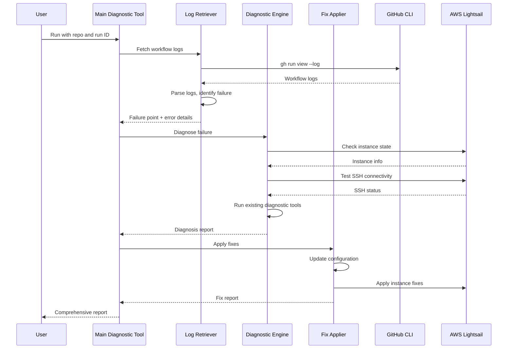

# Design Document

## Overview

This design document describes a comprehensive diagnostic and fix tool for investigating and resolving AWS Lightsail deployment workflow failures. The tool will leverage existing troubleshooting scripts in the `troubleshooting-tools/` directory and integrate with GitHub CLI to retrieve workflow logs, diagnose failures, and automatically apply fixes.

The system follows a three-phase approach:
1. **Investigation Phase**: Retrieve workflow logs and identify the failure point
2. **Diagnosis Phase**: Run diagnostic scripts to understand the root cause
3. **Fix Phase**: Apply automated fixes and verify the deployment

## Architecture

### High-Level Architecture

```
┌─────────────────────────────────────────────────────────────┐
│                    Main Diagnostic Tool                      │
│                  (investigate-workflow.py)                   │
└───────────────────────┬─────────────────────────────────────┘
                        │
        ┌───────────────┼───────────────┐
        │               │               │
        ▼               ▼               ▼
┌──────────────┐ ┌──────────────┐ ┌──────────────┐
│  Log         │ │  Diagnostic  │ │  Fix         │
│  Retriever   │ │  Engine      │ │  Applier     │
└──────┬───────┘ └──────┬───────┘ └──────┬───────┘
       │                │                │
       ▼                ▼                ▼
┌──────────────┐ ┌──────────────┐ ┌──────────────┐
│  GitHub CLI  │ │  Existing    │ │  Config      │
│  (gh)        │ │  Tools       │ │  Updater     │
└──────────────┘ └──────────────┘ └──────────────┘
```

### Component Interaction Flow



## Components and Interfaces

### 1. Main Diagnostic Tool (`investigate-workflow.py`)

**Purpose**: Orchestrates the investigation, diagnosis, and fix process.

**Interface**:
```python
class WorkflowInvestigator:
    def __init__(self, repo: str, run_id: str, region: str = "us-east-1"):
        """Initialize the investigator with repository and run ID"""
        
    def investigate(self) -> DiagnosticReport:
        """Run full investigation and return comprehensive report"""
        
    def retrieve_logs(self) -> WorkflowLogs:
        """Retrieve workflow logs from GitHub"""
        
    def diagnose(self, logs: WorkflowLogs) -> Diagnosis:
        """Diagnose the failure based on logs and instance state"""
        
    def apply_fixes(self, diagnosis: Diagnosis) -> FixReport:
        """Apply automated fixes based on diagnosis"""
        
    def generate_report(self) -> str:
        """Generate human-readable diagnostic report"""
```

**Key Methods**:
- `investigate()`: Main entry point that runs the full diagnostic flow
- `retrieve_logs()`: Fetches workflow logs using GitHub CLI
- `diagnose()`: Analyzes logs and runs diagnostic scripts
- `apply_fixes()`: Applies automated fixes
- `generate_report()`: Creates comprehensive report

### 2. Log Retriever (`log_retriever.py`)

**Purpose**: Retrieves and parses GitHub Actions workflow logs.

**Interface**:
```python
class LogRetriever:
    def __init__(self, repo: str, run_id: str):
        """Initialize with repository and run ID"""
        
    def fetch_logs(self) -> str:
        """Fetch raw logs from GitHub using gh CLI"""
        
    def parse_logs(self, raw_logs: str) -> WorkflowLogs:
        """Parse logs into structured format"""
        
    def identify_failure_point(self, logs: WorkflowLogs) -> FailurePoint:
        """Identify which job and step failed"""
        
    def extract_error_messages(self, logs: WorkflowLogs) -> List[str]:
        """Extract error messages from logs"""
```

**Key Data Structures**:
```python
@dataclass
class WorkflowLogs:
    jobs: Dict[str, JobLog]
    overall_status: str
    conclusion: str
    
@dataclass
class JobLog:
    name: str
    status: str
    steps: List[StepLog]
    
@dataclass
class StepLog:
    name: str
    status: str
    output: str
    
@dataclass
class FailurePoint:
    job_name: str
    step_name: str
    error_message: str
    error_type: str  # ssh_failure, health_check_failure, etc.
```

### 3. Diagnostic Engine (`diagnostic_engine.py`)

**Purpose**: Runs diagnostic checks on the Lightsail instance and application.

**Interface**:
```python
class DiagnosticEngine:
    def __init__(self, instance_name: str, region: str):
        """Initialize with instance details"""
        
    def check_instance_state(self) -> InstanceState:
        """Check Lightsail instance state"""
        
    def test_ssh_connectivity(self) -> SSHStatus:
        """Test SSH connection to instance"""
        
    def run_application_diagnostics(self) -> AppDiagnostics:
        """Run Node.js/application diagnostics via SSH"""
        
    def test_health_endpoints(self, endpoints: List[str]) -> EndpointResults:
        """Test health check endpoints"""
        
    def diagnose_failure(self, failure_point: FailurePoint) -> Diagnosis:
        """Diagnose failure based on failure point and diagnostics"""
```

**Key Data Structures**:
```python
@dataclass
class InstanceState:
    exists: bool
    state: str  # running, stopped, pending, etc.
    public_ip: str
    blueprint_id: str
    
@dataclass
class SSHStatus:
    accessible: bool
    error_message: str
    connection_time: float
    
@dataclass
class AppDiagnostics:
    nodejs_version: str
    npm_installed: bool
    pm2_status: str
    app_logs: str
    localhost_accessible: bool
    
@dataclass
class Diagnosis:
    failure_type: str
    root_cause: str
    recommended_fixes: List[str]
    confidence: float
```

### 4. Fix Applier (`fix_applier.py`)

**Purpose**: Applies automated fixes based on diagnosis.

**Interface**:
```python
class FixApplier:
    def __init__(self, repo_path: str, instance_name: str, region: str):
        """Initialize with repository path and instance details"""
        
    def fix_blueprint_id(self, config_file: str) -> bool:
        """Fix blueprint_id format (underscores to hyphens)"""
        
    def fix_port_configuration(self, config_file: str, detected_port: int) -> bool:
        """Update port configuration to match application"""
        
    def add_health_endpoint(self, app_file: str) -> bool:
        """Add default health check endpoint to application"""
        
    def fix_firewall_rules(self, config_file: str, port: int) -> bool:
        """Add application port to firewall rules"""
        
    def apply_all_fixes(self, diagnosis: Diagnosis) -> FixReport:
        """Apply all recommended fixes"""
```

**Key Data Structures**:
```python
@dataclass
class FixReport:
    fixes_applied: List[str]
    fixes_failed: List[str]
    config_changes: Dict[str, Any]
    success: bool
```

### 5. Integration with Existing Tools

**Purpose**: Leverage existing troubleshooting scripts.

**Interface**:
```python
class ExistingToolsIntegration:
    def __init__(self, instance_name: str, region: str):
        """Initialize with instance details"""
        
    def run_debug_nodejs(self) -> str:
        """Run troubleshooting-tools/nodejs/debug-nodejs.py"""
        
    def run_extract_instance_info(self) -> Dict[str, Any]:
        """Run troubleshooting-tools/general/extract-instance-info.py"""
        
    def run_fix_nodejs(self) -> bool:
        """Run troubleshooting-tools/nodejs/fix-nodejs.py"""
```

## Data Models

### Configuration File Structure

The deployment configuration file (`deployment-nodejs.config.yml`) has the following key sections:

```yaml
lightsail:
  instance_name: string
  blueprint_id: string  # Must use hyphens (ubuntu-22-04)
  bundle_id: string
  
application:
  type: string
  port: integer  # Must match application code
  
dependencies:
  firewall:
    config:
      allowed_ports: list[string]  # Must include application port
      
monitoring:
  health_check:
    endpoint: string  # Must exist in application
    port: integer  # Must match application port
```

### Workflow Log Structure

GitHub Actions workflow logs follow this structure:

```
Job: load-config
  Step: Checkout code
  Step: Load Configuration
  
Job: test
  Step: Setup Node.js
  Step: Run tests
  
Job: pre-steps-generic
  Step: Configure AWS credentials
  Step: Pre-flight Instance Health Check
  Step: Generic Environment Preparation
  
Job: application-package
  Step: Create deployment package
  
Job: post-steps-generic
  Step: Download application package
  Step: Generic Application Deployment
  
Job: verification
  Step: External Connectivity Test
```

## Correctness Properties

*A property is a characteristic or behavior that should hold true across all valid executions of a system—essentially, a formal statement about what the system should do. Properties serve as the bridge between human-readable specifications and machine-verifiable correctness guarantees.*

### Property 1: Log Retrieval Completeness

*For any* valid GitHub repository and workflow run ID, retrieving logs should return all job logs or fail with a clear error message.

**Validates: Requirements 1.1, 1.2**

### Property 2: Failure Point Identification

*For any* workflow logs containing a failure, the diagnostic engine should identify exactly one primary failure point (job and step).

**Validates: Requirements 2.2, 2.5**

### Property 3: SSH Connectivity Retry

*For any* SSH connection attempt, if the first attempt fails, the system should retry with exponential backoff up to the configured maximum attempts.

**Validates: Requirements 4.4**

### Property 4: Configuration Validation Consistency

*For any* deployment configuration file, if blueprint_id contains underscores, validation should flag it as invalid.

**Validates: Requirements 7.1**

### Property 5: Port Configuration Consistency

*For any* deployment configuration, the verification port, firewall allowed ports, and application port should all be consistent.

**Validates: Requirements 7.2, 7.3**

### Property 6: Health Endpoint Retry Behavior

*For any* health endpoint test, if the endpoint returns a non-200 status, the system should retry up to the configured maximum attempts before reporting failure.

**Validates: Requirements 6.2**

### Property 7: Fix Application Idempotence

*For any* configuration fix (blueprint_id, port, firewall), applying the fix twice should produce the same result as applying it once.

**Validates: Requirements 8.1, 8.2, 8.4**

### Property 8: Diagnostic Report Completeness

*For any* completed investigation, the diagnostic report should include workflow status, instance state, SSH status, and application diagnostics.

**Validates: Requirements 9.1, 9.2, 9.3, 9.4**

### Property 9: Error Message Extraction

*For any* workflow logs containing errors, the log parser should extract all error messages that match common error patterns (SSH timeout, HTTP error, npm error).

**Validates: Requirements 2.3, 2.4, 2.5**

### Property 10: Existing Tool Integration

*For any* diagnostic operation that has a corresponding existing tool, the system should use the existing tool rather than reimplementing the functionality.

**Validates: Requirements 10.1, 10.2, 10.3, 10.4**

## Error Handling

### GitHub CLI Errors

**Error**: GitHub CLI not installed or not authenticated
**Handling**: 
- Check if `gh` command is available
- If not available, provide installation instructions
- If not authenticated, provide `gh auth login` instructions
- Exit with clear error message

**Error**: Workflow run not found
**Handling**:
- Verify repository exists and is accessible
- Verify run ID is valid
- Provide suggestions (check repository name format, verify run ID)

### AWS Lightsail Errors

**Error**: Instance not found
**Handling**:
- Report that instance creation likely failed
- Check workflow logs for instance creation step
- Suggest checking AWS console for partial resources

**Error**: SSH connection timeout
**Handling**:
- Retry with exponential backoff
- Check instance state (must be "running")
- Verify security group allows SSH (port 22)
- Report detailed connection diagnostics

### Application Errors

**Error**: Health endpoint not responding
**Handling**:
- Check if application process is running (PM2 status)
- Check application logs for startup errors
- Test localhost connectivity from instance
- Verify port configuration

**Error**: Missing dependencies
**Handling**:
- Check if npm install completed successfully
- Verify package.json exists
- Check for npm error logs
- Suggest running npm install manually

## Testing Strategy

### Unit Tests

Unit tests will verify specific functionality of individual components:

1. **Log Parser Tests**
   - Test parsing of successful workflow logs
   - Test parsing of failed workflow logs
   - Test extraction of error messages
   - Test identification of failure points

2. **Configuration Validator Tests**
   - Test blueprint_id format validation
   - Test port consistency validation
   - Test firewall rule validation
   - Test YAML syntax validation

3. **Fix Applier Tests**
   - Test blueprint_id conversion (underscore to hyphen)
   - Test port configuration updates
   - Test firewall rule additions
   - Test health endpoint addition

4. **SSH Connectivity Tests**
   - Test SSH connection with valid credentials
   - Test SSH retry logic
   - Test SSH timeout handling
   - Test command execution via SSH

### Property-Based Tests

Property-based tests will verify universal properties across many generated inputs. Each test should run a minimum of 100 iterations.

1. **Property Test: Log Retrieval Completeness**
   - Generate random repository names and run IDs
   - Verify that retrieval either succeeds with complete logs or fails with clear error
   - **Tag**: Feature: lightsail-deployment-workflow-fix, Property 1: Log Retrieval Completeness

2. **Property Test: Failure Point Identification**
   - Generate workflow logs with failures at different points
   - Verify exactly one primary failure point is identified
   - **Tag**: Feature: lightsail-deployment-workflow-fix, Property 2: Failure Point Identification

3. **Property Test: SSH Connectivity Retry**
   - Simulate SSH connection failures
   - Verify retry logic with exponential backoff
   - **Tag**: Feature: lightsail-deployment-workflow-fix, Property 3: SSH Connectivity Retry

4. **Property Test: Configuration Validation Consistency**
   - Generate configurations with various blueprint_id formats
   - Verify underscore format is always flagged
   - **Tag**: Feature: lightsail-deployment-workflow-fix, Property 4: Configuration Validation Consistency

5. **Property Test: Port Configuration Consistency**
   - Generate configurations with various port settings
   - Verify all port fields are consistent or validation fails
   - **Tag**: Feature: lightsail-deployment-workflow-fix, Property 5: Port Configuration Consistency

6. **Property Test: Health Endpoint Retry Behavior**
   - Simulate health endpoint failures
   - Verify retry logic up to maximum attempts
   - **Tag**: Feature: lightsail-deployment-workflow-fix, Property 6: Health Endpoint Retry Behavior

7. **Property Test: Fix Application Idempotence**
   - Apply fixes to configurations multiple times
   - Verify applying fix twice produces same result as once
   - **Tag**: Feature: lightsail-deployment-workflow-fix, Property 7: Fix Application Idempotence

8. **Property Test: Diagnostic Report Completeness**
   - Generate various investigation scenarios
   - Verify all required sections are present in report
   - **Tag**: Feature: lightsail-deployment-workflow-fix, Property 8: Diagnostic Report Completeness

9. **Property Test: Error Message Extraction**
   - Generate logs with various error patterns
   - Verify all matching errors are extracted
   - **Tag**: Feature: lightsail-deployment-workflow-fix, Property 9: Error Message Extraction

10. **Property Test: Existing Tool Integration**
    - For operations with existing tools, verify existing tool is called
    - Verify no reimplementation of existing functionality
    - **Tag**: Feature: lightsail-deployment-workflow-fix, Property 10: Existing Tool Integration

### Integration Tests

Integration tests will verify end-to-end functionality:

1. **Test: Investigate Real Workflow Failure**
   - Use actual failed workflow run
   - Verify complete investigation flow
   - Verify diagnostic report is generated

2. **Test: Apply Fixes to Real Configuration**
   - Use actual deployment configuration with issues
   - Apply fixes
   - Verify configuration is corrected

3. **Test: SSH Diagnostics on Real Instance**
   - Connect to actual Lightsail instance
   - Run diagnostic commands
   - Verify results are captured

### Test Configuration

- **Property-based testing library**: Use `hypothesis` for Python
- **Minimum iterations**: 100 per property test
- **Test data generation**: Generate realistic workflow logs, configurations, and error messages
- **Mocking**: Mock GitHub CLI and AWS API calls for unit tests
- **Real resources**: Use real GitHub repos and Lightsail instances for integration tests (with cleanup)
